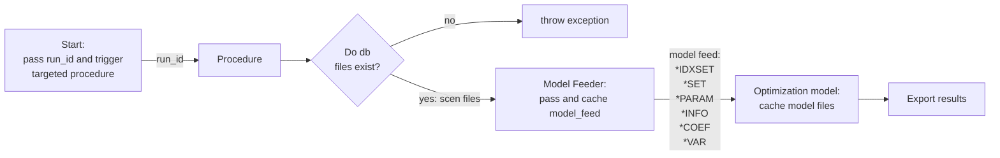

## Metaheuristic

to be continued..

Example of flowchart using mermaid.
This will be applied for providing a high-level explanation for optimization algorithms in this module.

> **Warning**
> This is warning
